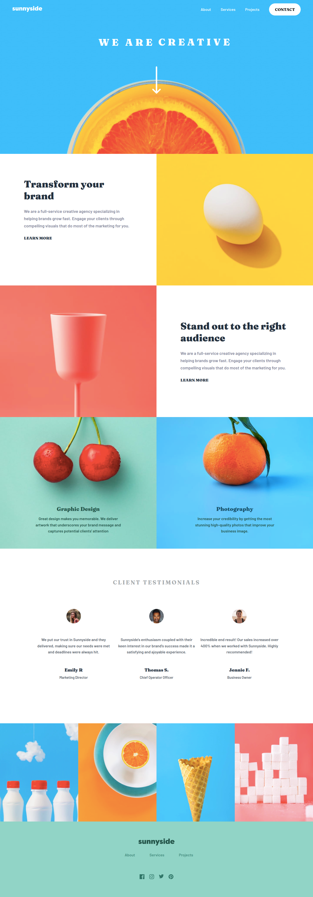

# Frontend Mentor Sunnyside Agency Challenge

This project was created as a solution to the [Sunnyside Agency Challenge](https://www.frontendmentor.io/challenges/sunnyside-agency-landing-page-7yVs3B6ef) at [Frontend Mentor](https://www.frontendmentor.io/home) and the completed website can be seen **[HERE](https://deusdeditvilar.github.io/sunnyside/)**.

Thecnologies used for this project:
- React
- Typescript

## Screencapture of the solution created:

